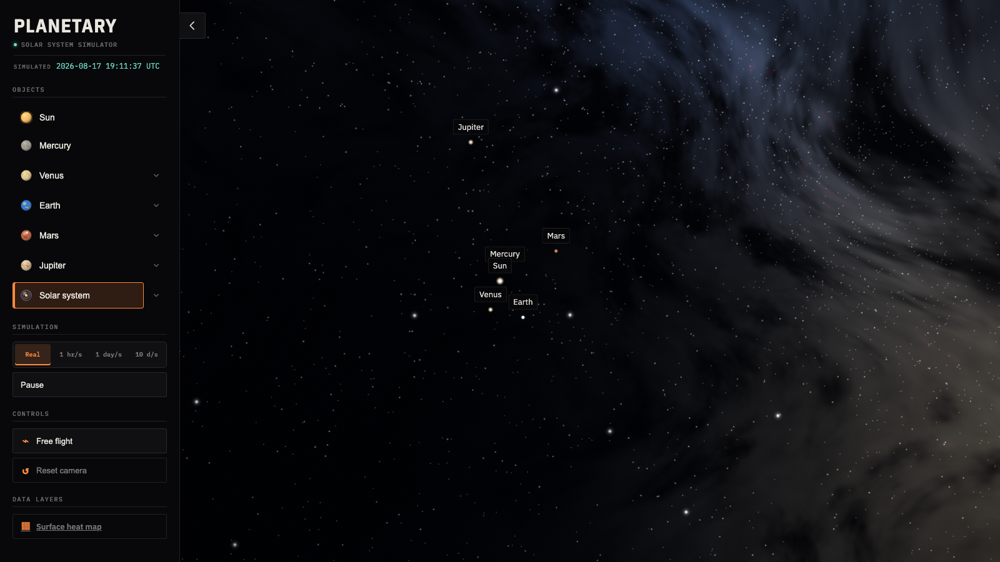
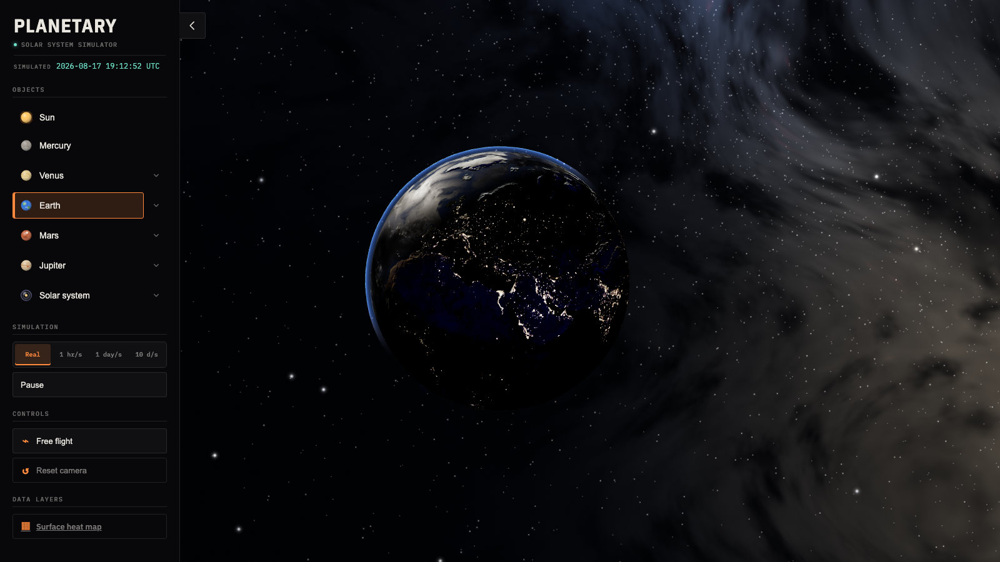
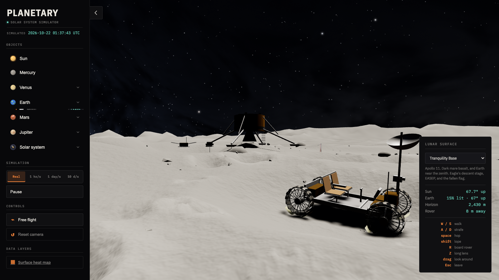

# Planetary

An interactive Three.js/React web application that visualizes the solar system with
scientifically accurate orbital mechanics, planetary physics, and real-time data
integration.

**🚀 [Try it live](https://planetary-look.vercel.app/)**



## What is it?

Planetary is a real-time simulation of the solar system that refuses to fudge anything
for appearance. Every body's position, size, spin and orbit is a pure function of the
simulated clock, computed from real ephemeris data — so the seasons, the phases, the
eclipses and Saturn's rings opening and closing over 29½ years all emerge from the
geometry rather than being animated in.

Everything is at true scale, including the empty space. Earth is 1 unit across against a
23,481-unit orbit.

The repo holds three things:

1. **3D Solar System** (`src/`) — the simulation, its three camera modes and its UI
2. **Heatmap Viewer** (`external/`) — a sea-surface-temperature app, embedded by iframe
3. **Chat backend** (`backend/`) — a small streaming service behind the in-app assistant

## Core Features

### 🌍 The solar system

- **All eight planets**, plus the Sun, and 17 moons:
  - **Earth** — day/night maps with night-side city lights, cloud shell, Fresnel
    atmosphere, and the analemma the Sun traces over a year at a fixed observer
  - **The Moon** — real phases from real geometry, tidally locked, and landable
  - **Mercury** — no atmosphere shell, deliberately; its 3:2 spin-orbit resonance is
    nowhere in the source and falls out of the rotation model anyway
  - **Venus** — two visible shells: the Magellan radar surface, and the opaque generated
    cloud deck that hides it (toggleable, which is the only way to see the ground)
  - **Mars** — Viking colour over MOLA relief, thin limb haze, and Phobos and Deimos,
    both generated rather than textured because neither is a sphere
  - **Jupiter** — oblate, not spherical, and the four Galileans locked 4:2:1 in a Laplace
    resonance that no line of code imposes
  - **Saturn** — a generated ring system built from measured boundary radii and Cassini
    occultation optical depths, casting its own translucent shadow onto the cloud tops,
    with seven moons including Titan and its haze layer
  - **Uranus and Neptune** — the only bodies with no photographic map, generated for
    opposite reasons: nothing is on Uranus, and nothing on Neptune stays put
- **Live ISS tracking** — real position from the Open Notify API, used to *re-anchor* a
  propagated orbit rather than being interpolated, so the station keeps flying when the
  feed is unavailable. Its orbit ring and ground track can be drawn together, and they
  are not the same curve: the ground turns 23.2° east under each 92.6-minute pass.
- **True scale** — 1 scene unit = 1 Earth radius, orbits included. From Earth the Sun
  subtends 0.5329° and the Moon 0.5179°, a ratio of 1.03 — nobody put that in; it is why
  total eclipses just barely work.
- **Verified orbits** — every body's elements were fitted to JPL ephemeris data and run
  back against Horizons over 2000–2030. Residuals are recorded in the source beside each
  one (Neptune's is 0.011° RMS).



### 🎮 Three camera modes

- **System view** — orbit and zoom across 60 AU; click any body or use the nav panel to
  fly to it. The camera follows moving targets rather than aiming at where they were.
- **Free flight** — WASD + mouse, with speed proportional to the clearance to the nearest
  surface. At true scale no fixed speed works: inspecting the ISS wants 0.01 units/s and
  reaching Mars wants 1000.
- **Lunar surface** — land at any of 11 sites, on foot or in the Lunar Roving Vehicle.
  This replaces the solar-system render entirely and rebuilds the scene in **metres**:
  a 6 km polar terrain grid, a horizon that emerges at 2,430 m because it cannot be
  anywhere else, Hapke's opposition surge, ballistic dust with no air to hold it up, and
  bootprints and wheel ruts that accumulate into the ground's own shading. The six Apollo
  sites have their descent stages and flags; the other five have nothing, because nobody
  has been there.



### 🤖 In-app assistant

A chat widget that can answer questions about what you are looking at and fly the camera
for you. The model is told the live simulation state before each message and has exactly
one tool (`focus_body`), on purpose — every extra tool is another thing a 7B model can
reach for at the wrong moment. Backed by a stateless Express service streaming NDJSON
from Ollama; see [`backend/README.md`](backend/README.md).

### 🌡️ Environmental data

- **Heatmap visualization** — sea-surface-temperature data on an interactive map
- **Palette selection** — viridis, turbo, or spectral
- **Real data processing** — reads a 36000×17999 binary SST grid and rasterizes it
  server-side with `node-canvas`

### ⚙️ Performance

- **Quality tiers** (`low` | `medium` | `high` | `ultra`) chosen once at load from
  hardware signals, setting sphere segment counts, terrain density, shadow-map size, dust
  budget, MSAA and which of three texture resolutions to download. The full-resolution
  texture set is roughly 800 MB in GPU memory, which is the difference between running
  and being killed by the OS on a phone.
- **Adaptive resolution** — the drawing buffer resizes continuously from measured frame
  time, which is the only thing that catches thermal throttling, battery saver, or a
  window dragged onto a 5K display.
- Pin either with `?quality=low|medium|high|ultra`.

## Navigation

| Key | Action |
| --- | --- |
| `F` | Toggle free flight |
| `L` | Land on / leave the Moon |
| `Esc` | Exit whichever mode you are in |
| `W` `A` `S` `D` | Move (free flight, walking, driving) |
| `Q` / `E` | Down / up (free flight) |
| `Shift` | Boost (free flight) |
| `Space` | Hop (on foot) |
| `R` | Board or leave the rover |
| `Z` | Zoom (lunar surface) |
| Mouse | Look around / orbit; click a body to fly to it |

Everything else — planets, moons, orbit lines, cloud and haze toggles, time controls —
lives in the nav panel.

## Getting started

```bash
npm install
npm run dev:planetary          # the 3D scene alone, port 5173
```

Other entry points:

| Command | What it runs |
| --- | --- |
| `npm run dev:mf` | Planetary + heatmap client |
| `npm run dev:mf:full` | Planetary + heatmap client + heatmap API |
| `npm run dev:chat` | Planetary + chat backend (needs Ollama; see `backend/README.md`) |
| `npm run build` | Production build of both HTML entry points |
| `npm run preview` | Preview the production build |

The heatmap sub-app has its own dependencies: run `npm run setup:heatmap` and
`npm run setup:heatmap:server` once first. The chat backend needs `npm run setup:chat`.

There is no test suite at the root. Type errors do not block builds (`noEmit: true`);
check manually with `npx tsc --noEmit`.

## Architecture

Built with **Three.js**, **React**, **Vite**, **TypeScript** and **SCSS**.

The 3D scene is plain imperative Three.js — React mounts a container and calls
`initScene()` once. The scene graph is deliberately shallow and identical for every
planet: a system node on the orbit, an axis node holding a fixed IAU pole that is *never
touched again*, and the planet spinning inside it. That structure is the whole mechanism
behind the seasons, Saturn's ring tilt and Uranus's 42-year polar day; none of the three
is coded anywhere.

```
src/
├── script.ts              the scene, the loop, the camera
├── orbits.ts              Keplerian mechanics, precession, frame conversions
├── simulation.ts          the clock
├── quality.ts             tiers and adaptive resolution
├── planets/               one module per body
│   └── earth/moon-surface/  the lunar surface mode, in metres
├── nav-panel/ chat-widget/ *-hud/   the UI
└── constants/planets.const.ts       every real-world figure, in one place
```

The heatmap client and server are independent projects under `external/`, with their own
`package.json` and lockfiles. They are not part of the root workspace — they run as
sibling dev servers and are iframed in.

`CLAUDE.md` carries the detailed architecture notes, including the traps that are easy to
re-introduce.

## Credits

Textures are NASA public-domain imagery, with one CC BY 4.0 exception. See
[`public/textures/CREDITS.md`](public/textures/CREDITS.md).

## License

Proprietary — all rights reserved. The source is public to be read, not reused: no
licence is granted to use, copy, modify, deploy or distribute it, and no one may
present it as their own work — in a portfolio, a CV, a demo, coursework or anywhere
else. See [`LICENSE`](LICENSE), which also covers the third-party material this does
not apply to. Learning from it and then building your own thing is welcome. For
anything else, ask.
